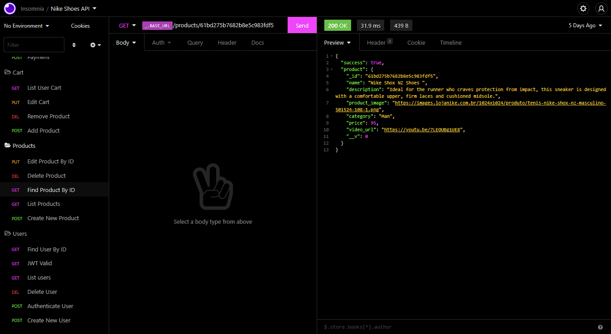

# 🛒 - NikeShoes - API - 🛒

## Demo 📸

 

## Application deploy with Heroku: :dash:

> https://nikeshoes-api.herokuapp.com/docs/

## 📖 About the Project

NikeShoes-API - This API is a Nike shoe e-commerce that allows the API consumer to manipulate the application.

## 📗 Features

| Feature  |  Coded?       | Description  |
|----------|:-------------:|:-------------|
| Add Product in Cart | &#10004; | Ability to see the Cart and it items |
| Remove Product from Cart | &#10004; | Ability of Remove a Cart |
| Edit Product Quantity in Cart | &#10004; | Ability of add a new Item on the Cart |
| List User Cart | &#10004; | Ability of Remove a Item from the Cart |
| Checkout | &#10004; | Ability of Make Checkout |
| Add a Product | &#10004; | Ability of Add a Product on the System |
| List Products | &#10004; | Ability of List Products |
| List Products By Category | &#10004; | Ability of List Products By Category |
| Edit a Product | &#10004; | Ability of Edit a Product |
| Delete a Product | &#10004; | Ability of Delete a Product |
| Create new user | &#10004; | Ability of Create New User in System |
| Authenticate | &#10004; | Ability of Authenticate |
| List Users | &#10004; | Ability of List Users |
| Find User By ID | &#10004; | Ability of List a Product |
| Delete User BY ID | &#10004; | Ability of Delete a User |

## 🛠 Technologies

<li><a href="https://nodejs.org/en/">Node.js</a></li>
<li><a href="https://www.npmjs.com/package/ts-node-dev">ts-node-dev</a></li>
<li><a href="https://eslint.org">Eslint</a></li>
<li><a href="https://prettier.io">Prettier</a></li>
<li><a href="Typescriptlang.org">Typescript</a></li>
<li><a href="https://editorconfig.org">EditorConfig</a></li>
<li><a href="https://expressjs.com">Express.js</a></li>
<li><a href="https://www.npmjs.com/package/cross-env">Cross-env</a></li>
<li><a href="https://jestjs.io">Jest</a></li>
<li><a href="https://www.npmjs.com/package/supertest">Supertest</a></li>
<li><a href="https://www.npmjs.com/package/ts-jest">Ts-jest</a></li>
<li><a href="https://www.npmjs.com/package/bcryptjs">Bcryptjs</a></li>
<li><a href="https://www.mongodb.com/atlas/database">MongoDB</a></li>
<li><a href="https://jwt.io">JWT</a></li>
<li><a href="https://stripe.com/br">Stripe</a></li>
<li><a href="Swagger.io">Swagger</a></li>

## 💻 How to run the application

#### Pre-requisites:
You must have the tools installed:  <a href="">Git</a>, <a href="">Node.js</a>. And create a new file called: .env, that follow .env.example credentials example.

<pre>
# In the terminal, clone the project:
$ git clone https://github.com/Wesley-wsl/NikeShoes-backend.git

# Enter the project folder:
$ cd NikeShoes-backend

# Install dependencies:
$ yarn install
or
$ npm install

# Run the application:
$ yarn start
or
$ npm run start
</pre>

Okay, now you can access the application from the route:  <a href="https://localhost:3333/">https://localhost:3333/</a>
